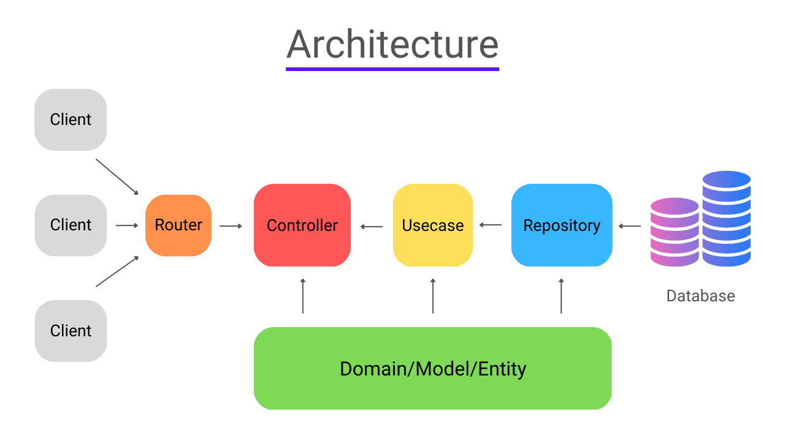

# Go Web Service Demo Project

This demonstration project showcases a Go-based web service, highlighting best practices and architecture for modern Go web applications. It uses an event processing system as a concrete example to illustrate the construction of a fully functional and well-structured Go web service.

## Project Overview

This demo project centers around event handling, demonstrating the complete workflow from database operations to API design and application bootstrapping. Through this practical use case, developers can gain valuable insights into building scalable, high-performance, and maintainable web services in Go.

## Key Features

- Clean Architecture implementation
- AWS SQS integration for event processing
- RESTful API with Echo framework
- PostgreSQL with GORM, supporting read replicas
- Graceful shutdown mechanism
- Environment-based configuration

## Project Structure

- `adapter/storage`: Database connection and configuration
  - `gorm.go`: GORM database abstraction layer setup
  - `postgres.go`: PostgreSQL database connection implementation
- `api`: API controllers and routing
  - `api.go`: API server and common request handlers
  - `event_controller.go`: Event-related API controllers
- `bootstrap`: Application initialization and configuration
  - `app.go`: Main application structure and startup logic
  - `config.go`: Configuration loading and management
  - `sqs.go`: AWS SQS consumer implementation
  - `wire.go`: Dependency injection configuration
- `domain`: Domain models and interface definitions
  - `event.go`: Event-related domain models and interfaces
- `usecase`: Business logic implementation
  - `event_usecase.go`: Event use case business logic
- `repository`: Database operations
  - `event_repository.go`: Event-related database operations
  - `repository.go`: Generic database operation functions
- `main.go`: Application entry point
